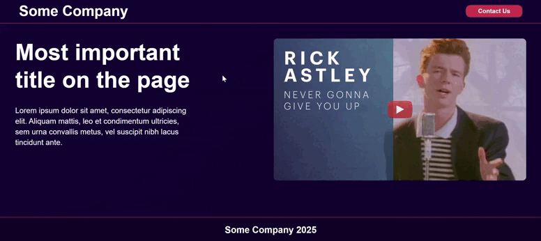
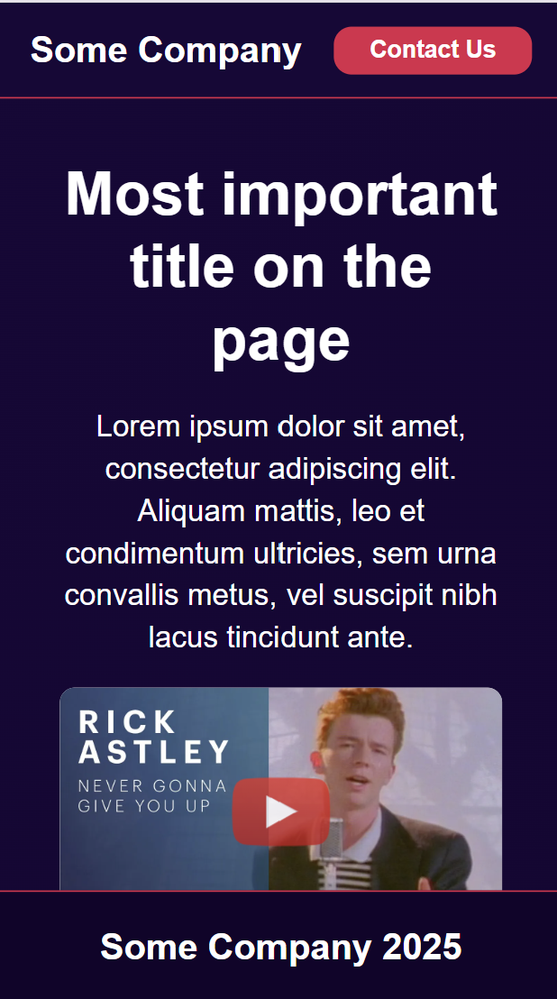
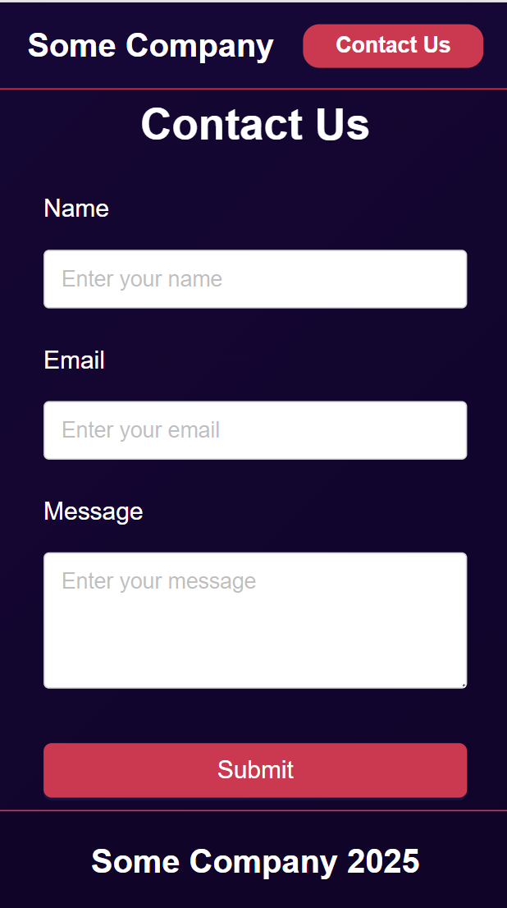
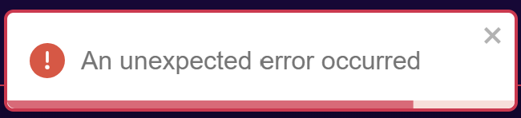
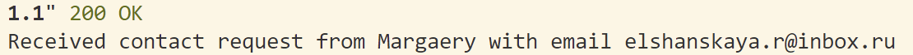

# Two-Page Website


## Tech Stack

### Frontend
- `React` + `TypeScript`
- `Vite` (build tool)
- `Ant Design` (UI components)
- `Styled Components` (CSS-in-JS)
- `React Hook Form` (form management)
- `react-lite-youtube-embed` (optimized video embedding)
- `Axios` (API client)

### Backend
- `Python` + `FastAPI`

## Setup Instructions

### Frontend
```bash
# Install dependencies
npm install

# Run development server
npm run dev

# Build
npm run build
```

### Backend
```bash
# Create and activate virtual environment
python -m venv venv
source venv/bin/activate  # On Windows: venv\Scripts\activate

# Install dependencies
pip install -r requirements.txt

# Run server
uvicorn main:app --reload
```

## Features

### Responsive design with mobile layout  



### YouTube Video Optimization
   Used `react-lite-youtube-embed`, video loads only when user interacts, improving initial page load


### Accessibility Features

- Semantic HTML structure
- Form validation with clear error messages


### Styling Approach
- Used Styled Components for component-specific styling
- Implemented a consistent color scheme
- Created reusable styled components for common UI elements
- Added hover and focus states for better user interaction
- Sticky header and footer on all pages  
- Used modern CSS features like flexbox and CSS Grid for responsive layouts

### Form Implementation
- Built with `React Hook Form` for efficient form handling
- Added client-side validation
- Implemented error states and messages  


- Added loading states during submission

### Backend Integration
- Simple Python backend to handle form submissions
- Logs form data to console

- Returns personalized response message

### Deployment:
- Create a `.env` file similar to `.env.example`.
- To deploy the application on port 8125, use `docker compose up`.
- The API is available at `http://{your_url}/api`.

## Author

Churina Margarita
